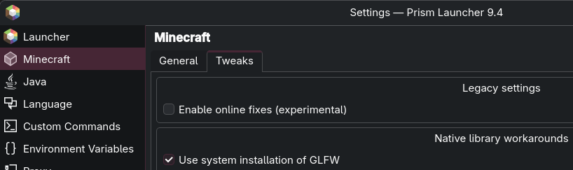

# glfw-wayland
A collection of not-yet-upstreamed GLFW Wayland patches. Mostly focues on improving the Minecraft experience.

Patches taken from https://github.com/BoyOrigin/glfw-wayland, but updated with proper window icon support.  

## Minecraft
For use with Minecraft on versions 1.21.x, use https://github.com/awumii/minecraft-wayland-icon-fix.   
Older versions should work out of the box.
> ⚠️ Don't forget to set a native library override. Use `-Dorg.lwjgl.glfw.libname=/path/to/libglfw.so.3.4` OR use **PrismLauncher** for easy checkbox.  


## Installation (Arch Linux)
```bash
git clone https://github.com/awumii/glfw-wayland
cd glfw-wayland
makepkg -si
```

## Installation outside Arch Linux
* Clone the GLFW source code from https://github.com/glfw/glfw
* Copy the patches to the cloned repository
* Apply the patches manually using `git apply -3 000x.patch`
* Follow the upstream instructions on compiling manually, or look at the PKGBUILD file.  

> Alternatively, use the scripts from the original repo mentioned at the top of the README. No idea if they still work.